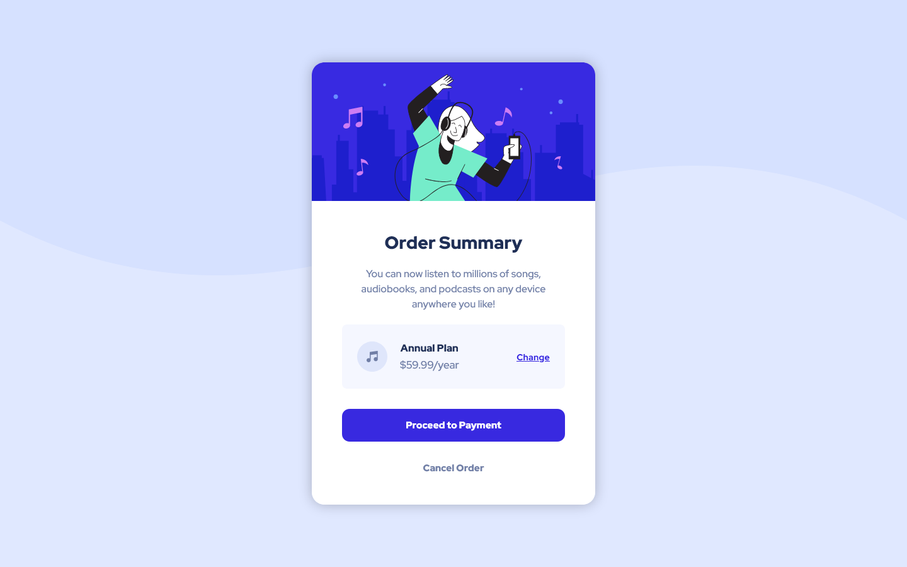

# 💻 Order Summary | Frontend Mentor

## 📖 Description

This is a Order Summary card component made with HTML, CSS and SASS, based on the challenge provided by *Frontend Mentor*. It was made with the free assets provided, which means the Figma/Sketch files weren't included.

This is my first time coding with SASS, it's not that hard but sure has plenty of resources to explore. I was a little confused at first, but watching a video from *FreeCodeCamp* and reading the docs helped me a lot.

It's a little complicated to make it look as equal as the design using only images, but it's a very neat challenge to do so.

## 🔨 Features

* HTML
* CSS
* SASS/SCSS
* BEM Convention
* Flexbox
* Responsiveness
* Coded with Visual Studio Code

## 🖼️ Screenshot

You can [check the project's repository here](https://github.com/GracilianoOG/fementor-order-summary) or the [live preview here](https://gracilianoog.github.io/fementor-order-summary/dist/).

### 💻 Desktop Layout

### 📱 Mobile Layout

## 🔗 Links

* [🔍 Frontend Mentor](https://www.frontendmentor.io/)
* [🔍 Order Summary Challenge](https://www.frontendmentor.io/challenges/order-summary-component-QlPmajDUj)